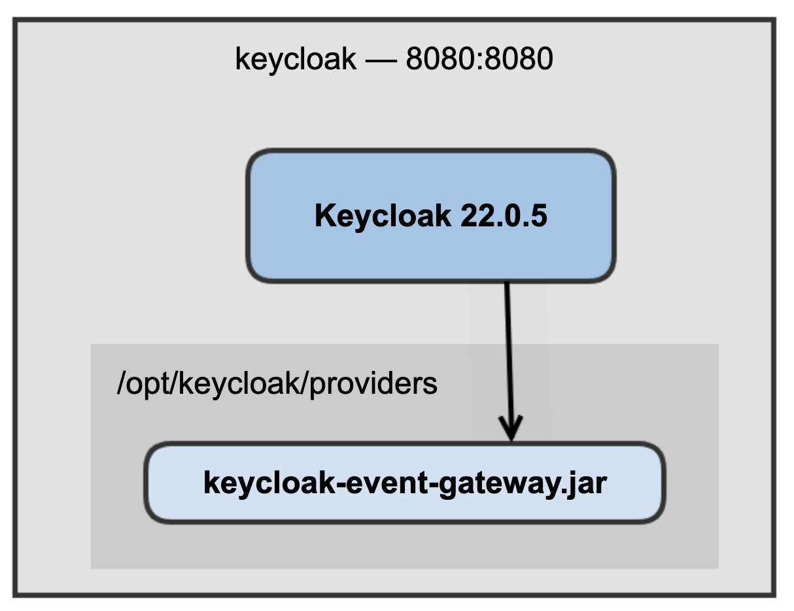

_[Back to the home page](../README.md)
— Previous Page: [3. How to build](./Build.md)
— Next Page: [5. How to test](./Test.md)_

--

# 4. How to deploy locally


Prerequisites: docker-compose

## Run the stack

```shell
$ docker compose up -d
```

It deploys the following stack:





With a browser, go to [http://localhost:8080](http://localhost:8080)

* username: admin
* password: Pass;word1

## Stop the stack

```shell
$ docker compose down
```

--

_[Back to the home page](../README.md)
— Previous Page: [3. How to build](./Build.md)
— Next Page: [5. How to test](./Test.md)_
