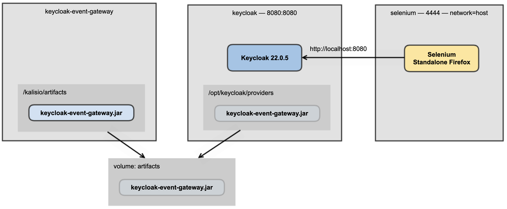

_[Back to the home page](../README.md)
— Previous Page: [4. How to deploy locally](./Deploy.md)
— Next Page: [6. Examples of JSON payloads](./Examples.md)_

--

# 5. How to test


## Run the tests

Prerequisites: Node, Selenium

```shell
$ cd test
$ docker-compose up -d
```


It deploys the following stack:




Then run:

```shell
$ npm install
$ export SELENIUM_REMOTE_URL=http://localhost:4444/wd/hub
$ npx mocha integration_tests.js
```

## Test results: screenshots

Screenshots are taken during the tests.

Examples can be seen here:
[keycloak-event-gateway-screenshots](https://gitlab.com/avcompris/kalisio/keycloak-event-gateway-screenshots/)


## Continuous Integration — CI

As for now, autonomous
tests are run in a GitLab CI
environment.

See the [.gitlab-ci.yml](../.gitlab-ci.yml) configuration.


--

_[Back to the home page](../README.md)
— Previous Page: [4. How to deploy locally](./Deploy.md)
— Next Page: [6. Examples of JSON payloads](./Examples.md)_
