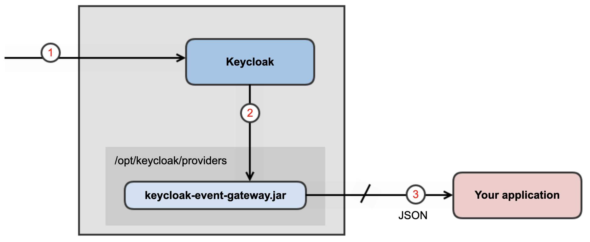

_[Back to the home page](../README.md)
— Previous page: [keycloak-event-gateway](../README.md)
— Next page: [2. Configuration](./Configuration.md)_

--

# 1. Installation and usage

## Installation

We’re using Keycloak 22.0.5.

Get the `keycloak-event-gateway-0.0.1-SNAPSHOT.jar`
JAR file.

See: [3. How to build](Build.md)  — if you want to
build the JAR yourself.

Alternatively you can retrieve the JAR through a
public Docker image:

```shell
$ KGATEWAY=kalisio/keycloak-event-gateway
$ docker pull \
   registry.gitlab.com/avcompris/$KGATEWAY/$KGATEWAY
$ docker tag \
   registry.gitlab.com/avcompris/$KGATEWAY/$KGATEWAY \
   kalisio/keycloak-event-gateway
$ docker run kalisio/keycloak-event-gateway ls /artifacts
keycloak-event-gateway-0.0.1-SNAPSHOT.jar

$ docker run kalisio/keycloak-event-gateway \
   cat /artifacts/*.jar > keycloak-event-gateway.jar
```


Copy the JAR to the `/opt/keycloak/providers/`
directory on your Keycloak installation.

Restart Keycloak.

## Usage

This Keycloak service provider will forward
any event emitted by Keycloak in a given realm,
to HTTP/HTTPS endpoints you declare.





It will send a
`Authorization: Bearer <accessToken>` with its
requests to the endpoints.

See the [2. Configuration](Configuration.md) page for more details.

It is the responsability of the HTTP
listener to
handle the request.
Requests are sent asynchronously, 
and no error on the listener side will be handled by
this plugin.

The data model is Keycloak’s.

See the [6. Examples of JSON payloads](Examples.md) page for actual cases.


--

_[Back to the home page](../README.md)
— Previous page: [keycloak-event-gateway](../README.md)— Next page: [2. Configuration](./Configuration.md)_
